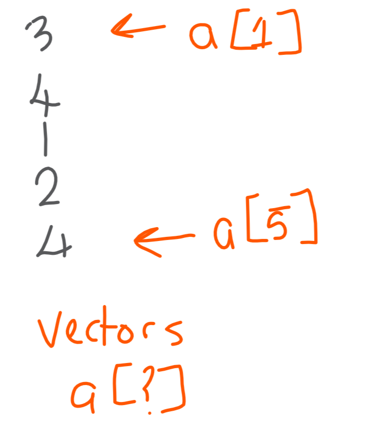

# R objects
## Other key syntax

Action | Operator | Example
------------- | ------------- | -------------
Create / update a variable | <- | `a <- 10`
Create / update a variable | = | `a = 10`
Create / update a variable | -> | `10 -> a`
Comment | # | `# This is my comment`
Help | ? | `?data.table`
Identifier | \` |  `` `1`<-2``

## In-memory
- All variables / objects will get stored in-memory;
- You need memory for operations too.

Function | Purpose  
------------- | -------------
`ls()` | List what's in-memory
`rm()` | Remove things from memory

## Vectors
A 1D object containing a single type of data

Function | Purpose  
------------- | -------------
`c()` | Combine values into a vector
`:` | Generate a sequence

```{r}
1:3
c("red","blue","orange")
```

### Exercises
1. See what's in the variable `LETTERS`;
2. Write a check to see if "a" is present in `LETTERS`;
3. Find out which values in the sequence 1 to 10 are greater than or equal to 3 and less than 7.
1. Make a vector containing the numbers 1 to 50;
2. Make a vector containing two words;
3. What happens when you combine these two vectors?

## Data.frames
A 2D object containing multiple classes of data

Function | Purpose  
------------- | -------------
`data.frame()` | Construct a data.frame

```{r}
data.frame(a=1:2,b=c("blue","red"))
```

### Exercises
1. Make a data.frame the two vectors you created in the vectors section;
2. What happened to your text vector?

## Lists
An object containing multiple types of objects

Function | Purpose  
------------- | -------------
`list()` | Construct a list

```{r}
list(a=1:2,
     b=c("blue","red"), 
     df=data.frame(a=1:2,b=c("blue","red")))
```

### Exercises
1. Make a list containing some of the variables you've created so far.

## Others
- **Matrix** A 2D object of one data type
- **Array** A nD object of one data type

# R data manipulation basics

## Grid references
R works in a grid reference system like [row , column]. So...

- For a 1D vector, there's just one position i.e. `vector[ row ]`
- For a data.frame, there's two positions i.e. `data.frame[ row , column ]`

## Grid references



Valid values include:

- Positive values or ranges;
- Negative values or ranges;
- Boolean ranges;
- Names or vectors of names.

## Grid referencing


## Grid referencing vectors
```{r}
LETTERS[1]
LETTERS[1:3]
LETTERS[-1]
LETTERS[-13:-1]
LETTERS[c(TRUE,FALSE)]
```

## Grid referencing data.frames
```{r eval=TRUE}
myDF<-data.frame(a=1:3, b=2:4, c=3:5)
myDF[1,]
myDF[,-1]
myDF[1,1]
myDF[1:2,]
myDF[c(TRUE,FALSE,TRUE),]
myDF[,"a"]
```

### Exercises
1. Select all `letters` before "x";
2. Select the first 5 rows from the built-in data.frame `iris`;
3. Select the first 2 columns from `iris`;
4. Select the column Sepal.Length from `iris` by name.

## Name-checking
Row names can be used to extract values.

```{r}
myNamedVec<-c("red"="RED","blue"="BLUE")
myNamedVec["red"]
```

Column names can also be referenced.

```{r}
colnames(  iris[,"Species"]    )
colnames(  iris$Species        )

colnames(  iris[,c("Sepal.Width","Species")]    )
```

## Self-referencing
Useful for creating booleans, you can create a vector and use this inside your grid reference system.
```{r}
LETTERS[LETTERS<"T"]
myDF[myDF$a<=2,]
```


### Exercises
1. Get all `letters` that occur after "g";
2. Select rows from the `iris` data.frame where the `Sepal.Length` is greater than 5.8cm;
3. Select rows from the `iris` data.frame where the Sepal.Width is below the average for that column.

## Updating
You can update part or all of simple objects by assigning new values against a grid-reference.

```{r}
myVec<-LETTERS[1:3]
myVec[1]<-"Z"
myVec

myDF[1, ]<- 1:3
myDF
```

## Deleting
You can use the selections to remove values

```{r}
myVec<-myVec[-2]
myVec

myDF<-myDF[-3,-1]
myDF
```

### Exercises
1. Select everything from `iris` except the Species column;
2. Create a copy of the `iris` data that just contains the first 100 rows and call it `myIris`;
3. Update the species column to the value "Unknown" in `myIris`;
4. Delete rows from `myIris` where the sepal length is greater than 5.5.

