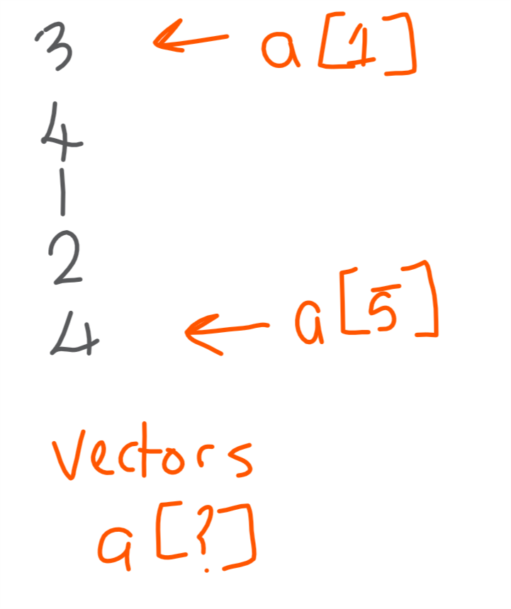

# (PART) Preamble {-} 


# Introduction {-}
Welcome to the first book in Locke Data's series of books on R and data science! 

This first book introduces R, helps you get the most out of the RStudio programming environment, and teaches basic operations in R. 

Basic doesn't mean funky alas so if you want to skip ahead to the funky bits, you can get the next book. 

<a rel="license" href="http://creativecommons.org/licenses/by-nc/4.0/"></a><br />This work is licensed under a <a rel="license" href="http://creativecommons.org/licenses/by-nc/4.0/">Creative Commons Attribution-NonCommercial 4.0 International License</a>.

# Prerequisites {-}
This book assumes no prior knowledge of programming.

Basic use of calculators and Excel is assumed. This is so that if we say things like `(5*5)-2` you know that I mean something like "subtract two from the result of five multiplied by five". If you're not sure about this type of thing you might struggle.

You should be able to install (or get installed) R, RStudio, and, if on Windows, RTools. You can code online at [r-fiddle.org](//www.r-fiddle.org/) but this might be unreliable. The instructions for installation in 

# Steph Locke {-}
# Locke Data {-}
Locke Data is a consultancy that helps people and organisations get started with data science. We offer training, advice, and technical leadership to make sure things go more smoothly.

Find out more about us at [itsalocke.com](https://itsalocke.com). 

# Conventions {-}

Throughout this book various conventions will be used.

In terms of basic formatting:

- This is standard text.
- `This is code or a symbol`
- <kbd>Keyboard Key</kbd>

This is a book about coding, so expect code blocks. Code blocks will typically look like. Note the result underneath - this is the result of executing the code block.

```{r}
"this is a code block"
```

There will also be callouts throughout the book. Some are for information, some expect you to do things.

```{block, type="protip"}
This is a tip about what I've just said.
```

```{block, type="glass"}
This is kind of like a tip but is for those break-the-glass, moments where things have gone very very wrong and you need to escape.
```

```{block, type="readerTODO"}
This is something I recommend you do as you're reading.
```

```{block, type="future"}
This let's you know that something I mention briefly will be followed up later, whether in this book or a later one.
```

```{block, type="TODO"}
If this is still here, someone at Locke Data needs to do something!
```

# (PART) R fundamentals {-} 
# About R

R is an open source language released in 2001 that's ideal for data wrangling and data science.


R has a long lineage - it was written to re-implement the language [S](https://en.wikipedia.org/wiki/S_(programming_language)). S was a commerical language written in the mid-1970s to enable statistical and graphical processing.  Indeed much code written in S can still run today, a phenomenal feat! If you ever look at how R and wonder "Why on Earth does it work like that?", the usual answer is "Because S".^[If you'd like to find out about the assignment operators' history (`<-` and `->`) and many of the other quirks of R, the article [Rbitrary](//ironholds.org/projects/rbitrary/) is fantastic and highly irreverent reading.] 

```{r}
plot(rnorm(10))
```

The last paragraph might lead you to ponder why R is in use today and why the popularity is growing?

R is a vibrant ecosystem that enables people to extend, enhance, and replace itself. There are many paradigms in R to facilitate object-oriented programming, functional programming, and more. If you can write something in R, C++, FORTRAN^[Yes, it still exists and yes, R still relies on it for some key algorithms], Python, or JavaScript you can extend R. 

There are currently more than eleven thousand extensions to R a.k.a. packages in the core ecosystem ([CRAN](https://www.r-project.org/)) and two and a half thousand packages in the genomics ecosystem ([BioConductor](https://www.bioconductor.org/)). 

```{block type="future"}
We're also seeing emerging ecosystems and paradigms within CRAN. The [tidyverse](http://tidyverse.org/) is one such ecosystem, focussed primarily on analysing tabular data, and it will be used in future works extensively.
```

## Key points to know about R

- R works in-memory which means that the processing is fast but the amount of data you can process is limited to how much RAM your data takes up and how much your computations will require. 
- R is not multi-threaded by default. R works on a single CPU core and parallelisation requires additional packages and often additional coding.
- R is quirky! R works a bit like lots of languages which makes it easy to pick up in some respects, but because of the S compatability it's actually pretty darn old and a result, really odd in places. 
- Coding R will give you the typical gotcha's and add another, case sensitivity. R is (un)fortunately a language where "Red" and "red" are different and this also extends to variable and function names. As a consequence, the most common errors you'll find when writing code in R are:
    + Mis-placed or missing commas
	  + Mis-placed or missing brackets
	  + Incorrect case used when typing
- With so many packages available to extend R with, the answer to "how do I write this?" is usually "there's a package for that".

```{block, type="future"}
We'll look at finding packages later in this book.
```

# Why use R?
R as a programming language is brilliant at it's core competencies -- statistics and data visualisation. It's also a great "glue" language, by which I mean that you can use it perform computations in many different languages and combine the results smoothly. As a result, R enables you to be an effective data wrangler, data scientist, and/or data visualisation practitioner. 

I wanted to include some code snippets here that exemplify how little is required to do things in R that in other languages or tools used to take me a substantial amount of time.

```{block, type="future"}
These are illustrative only. Don't worry if they don't make much sense. Writing code like these examples will be covered in later books.
```

```{r include=FALSE}
library(tidyverse)
library(ggplot2)
```

## Data wrangling
A common issue I've had in the past is data from multiple sources that should usually conform to a template but don't. You end up with a whole stack of files that don't *quite* match the template and as a result getting all this data read, combined, and then output somewhere else is often an incredibly difficult task. 

This snippet of R code performs the following steps:

1. Make functionality from the tidyverse available
1. Identify files needing to be read and combined
2. Read each file individually, whilst applying a column type enforcement
3. Combine the results

Combining the results involves matching the columns by name. It will create new columns when it finds additional columns in some of the data and fill in the data. When columns are missing from a dataset it will put NAs in the column. 

```{r warning=FALSE, message=FALSE}
library(tidyverse)
list.files("../data", full.names = TRUE) %>% # Change "../data" to where your files are
  map_df(read_csv, col_types=cols("c")) %>% 
  bind_rows() ->
  allmydata

nrow(allmydata)
```

## Data science
An aspect of building models and operationalising them that I've always found a bit painful is mapping the pre-processing stages to an operational scenario i.e. how do I apply my pre-processing steps to new data in order to be able to make a prediction? 

If I want to scale numeric variables, I need to keep some sort of record of the mean and standard deviation in the case of a [z-score](http://stattrek.com/statistics/dictionary.aspx?definition=z%20score) or the minimum and maximum values if I wanted to do a [minmax score](https://en.wikipedia.org/wiki/Feature_scaling#Rescaling). Then I'd have to write something to apply these values to new data in an operational setting, or I'd have to transform my model's formula to apply the scales on the fly. 

If I wanted to take it a step further and perform a [Principal Component Analysis (PCA)](http://setosa.io/ev/principal-component-analysis/) to reduce the amount of features I was working with, I'd have no easy way to do that with the outputs of the R PCA function (`princomp()`). If I use these principal components in my model, how then to get these for my test data or in production?


This snippet of R code performs the following steps:

1. Make functionality from caret available
1. Split my data into training and test samples with the outcome column seperate
2. Build a linear regression model on data scaled using z-scores and turned into principal components 
3. Apply the transformations and linear model to get predictions for my test data


Instead of using some of the out of the box methods and writing a really long-winded set of code, I can use functionality from the package [caret](https://topepo.github.io/caret/) to add a pre-process step to my model develoment. It will then keep these pre-process steps as part of the model and whenever I use the model to make predictions it will first process the data based on the parameters and transformations used on the training data.

```{r}
library(caret)

training_data<-mtcars[1:20,-2]
training_outcome<-mtcars[1:20,2]
test_data<-mtcars[21:32,-2]
test_outcome<-mtcars[21:32,2]

model<-train(training_data, training_outcome,
             method="lm",
             preProcess = c("scale","center","pca"))
predictions<-predict(model, test_data)
```

## Data visualisation
Data visualisation is an area where R makes it especially difficult to choose just a single example. Instead of showing the many fancy or interactive visualisations you can do in R, I'm instead going to show a part of the workflow.

Often times, I need to make a chart and then make that chart for a lot of different datasets. These could be datasets for different customers, samples, or time slices.

I can make a chart in R using the package [ggplot2]() to build a chart of all data.
```{r}
library(ggplot2)
library(datasauRus)

myPlot<- ggplot(datasaurus_dozen, aes(x,y)) +
           geom_point()
```

If you want to make a [small multiples](https://en.wikipedia.org/wiki/Small_multiple) chart, where the charts are produced in a group, you can use the notion of facetting to make many small charts together.

```{r}
myPlot +
   facet_wrap(~dataset)
```

If you wanted to produce and save a chart per dataset you can provide updated data to a chart.

```{r}
myPlot %+% simpsons_paradox
```


# Using RStudio
[RStudio](//rstudio.com) is a coding interface to R that makes it easier for you to be productive.^[If coding interfaces were game modes, RStudio is Easy mode, Visual Studio is Normal, R-GUI is Hard, vim is Insane, and Emacs is Legacy.] I'm devoting substantial amounts of this book to your working environment as you can use it to make learning and coding R much easier by taking the time to understand it.

The interface will be split up into a top menu and then four panes, although only three may be visible when you first start RStudio.

```{block, type="TODO"}
Clean RStudio image, no arrows
```


```{block, type="readerTODO"}
If you don't already have it, you should [install R and RStudio](//www.rstudio.com/products/rstudio/download/#download). 

If you're on Windows, it's also great if you can install [Rtools](//cran.r-project.org/bin/windows/Rtools/). This gives you the tools to install packages from GitHub later on down the line.
```

## The console

```{block, type="TODO"}
Make a small gif of using the console
```

The (bottom) left hand section is the console. This is where you can execute R code directly.

To use the console you type some code alongside the `>` and hit <kbd>Enter</kbd> for the code to be executed. The result will then appear underneath your line of code. 

```{block, type="future"}
Errors, warnings, and messages will also appear in the console. We'll discuss what these are later in the book
```

```{block, type='readerTODO'}
Use the console to add two numbers together.
```

If the code you entered wasn't a complete statement e.g. `1 + 2 +`, when you hit <kbd>Enter</kbd>, the `>` will change to a `+` indicating the code you're writing will be appended to the line before it.

If you want to clean your console and start afresh, hit <kbd>Ctrl</kbd> + <kbd>L</kbd> to remove whatever has been executed in the console this session.

You can use your up and down arrow keys to navigate through previous code you've written and executed.

```{block, type='glass'}
If you commit one of the most common coding errors (incorrect amounts or places of brackets and commas) you might end up with an incomplete line and basically lock your console into having thte `+` symbol at the beginning of each line. If you find yourself stuck with commands just writing and writing and never executing, hit the <kdb>Esc</kdb> key to cancel the code and get back to the standard cursor. 
```

## Scripts

```{block, type="TODO"}
Create gif of adding a file
```

RStudio allows you to create and work with files containing code. These files give you a way to store and manage your code. 

The most common file types you might use are R files (`.R`) and rmarkdown files (`.Rmd`). 

```{block type='future'}
rmarkdown files are for generating documents with text and R code interleaved (like this book!) will be covered in a book in future. If you want to get going, checkout the [rmarkdown](//rmarkdown.rstudio.com) site.
```

You can create one of these files by going to *File > New > R Script*, the New File button, or with the hotkey combo^[I'm a big fan of hotkeys!] of <kbd>Ctrl</kbd> + <kbd>Shift</kbd> + <kbd>N</kbd>.

In an R script you can type code and execute it by hitting <kbd>Ctrl</kbd> + <kbd>Enter</kbd>^[This hotkey is really nifty as it'll find the start and end of a block of code and send it all to the console to be executed.], or selecting the code to run and hitting the Run button. 

You can execute all the code in a script by hitting <kbd>Ctrl</kbd> + <kbd>Shift</kbd> + <kbd>Enter</kbd> or hitting the Source button.

```{block, type="readerTODO"}
- Open a new R script. 
- Write `10*5` in it and execute the code.
```

## Code completion

```{block, type="TODO"}
Create a gif with code completion
```

Whilst writing scripts or typing in our console, we can get help and be more productive by using **code completion**. Code completion will pick up from what we've typed so far and provide a navigable list of suggestions. 

As we navigate through the list, it'll provide help text where possible and then it will complete the code we were typing.

- You access the code completion by hitting <kbd>Tab</kbd> whilst typing. 
- Once it's up you can keep typing to refine the list. 
- Your arrow keys allow you to navigate the list.
- Hit <kbd>Esc</kbd> to back out of the completion capability.
- Hit <kbd>Tab</kbd> to accept whatever value in the list is currently highlighted.

```{block, type="readerTODO"}
- On a new line of your script, type `a` and activate your code completion. Browse the list then cancel out of the list.
- Overwrite the `a` with an `A` and go back into the code completion. Do youu get the same list? What's different and why?
```

## Projects
So far you've seen R as a scratchpad (via the console) and for making an isolated script, but a lot of the time we have to be put data, multiple scripts, documentation and more into a **project**.

An RStudio project is a folder with an extra file. This file can be used to open RStudio, with everything laid out like it was before you closed the project. It can store preferences to allow projects to vary from the way you normally do things.^[Like converting tabs to spaces and the number of spaces characters it should replace with.]

```{block, type="protip"}
At this point in your R coding career, keeping everything where you left off is great. Later on, and especially if you work in anything where reproducibility is valued, you can go to *Tools > Project Options ...* and set the .Rdata fields to "no" so that nothing loads up into memory when you load the project.
```

You can, and should, create a new R project when embarking on a new area of work. To create a project go to *File > New Project*.

```{block, type="TODO"}
Create a gif of making a project
```

This will popup a dialogue that gives you the option to create a brand new project directory, create one from some existing directory you might already have, and creating one with the content of a project in your source control system.

Most commonly, you'll want to create a new directory project. Once selected it'll then give you the option to create an empty project, a shiny project, or an R package. You'll normally select the empty projects. Once an option is selected, provide a name and where the project should go.

```{block, type="future"}
Working with source control, shiny, and creating R packages are all in later books.
```

You can navigate to projects using the project option in the top right corner or in the *File* section.

```{block, type="readerTODO"}
Create a new project to store the answers to exercises and any code you try out during this book. You don't have to save the script you were working on before this (unless you want to!)
```

# Useful resources
Our coding environment RStudio is a great help to us. The code completion makes it easy to find things kind of related to what you're typing but sometimes you need to do a bit more digging or  read a bit more than the snippet of help in the code completion window.

## The built-in help
R has pretty great built-in help. You might understand some of it but there's usually lots of it and most help files give you examples to run.

The help files are accessible in the bottom right-hand corner of RStudio.

If you want to see some of the built-in help whilst using code completion, you can hit <kbd>F1</kbd>. Similarly, you can select a word in script and hit <kbd>F1</kbd> to go to the help.

If you don't have something specific to select from you can go to the help window and use the search facility. If there's a function that matches what you're typing that'll be shortlisted, and you can select it and hit <kbd>Enter</kbd> alternatively if you don't get a match, hitting <kbd>Enter</kbd> once you've finished typing will enact a fuzzier search.


Another way you can get help is by looking at the index of functions available for a given package. You go to the Packages tab and click on the package you're interested in. This loads up the index for that package and you can then read through what's available.

The help window has some handy navigation features to make it easier to use:

- In-file search bar for finding words in a help file
- Navigation arrows for moving between files like Back and Forwards on a web-browser.
- The New Window button creates a popup with the file so that you make it bigger or put it onto another monitor.

## Online
R is a great community that has produced many resources.

- You can search for previous R questions or ask new ones on the ubiquitous [Stack Overflow](//stackoverflow.com).
- If you're tweeting about R, use the hashtag *#rstats*. If you want to see what's happening in the R world, I recommend you follow [Mara Averick (\@dataandme)](//twitter.com/dataandme).
- RStudio provide a trove of fantastic [cheatsheets](//www.rstudio.com/resources/cheatsheets/) -- including one for being super-productive in RStudio. These are great to download and/or print in order to keep handy as you're learning.
- Documentation for R packages is available on [CRAN](//cran.r-project.org) but there a number of online sites that try to iprove the experience, including [rdrr.io](//rdrr.io) and [rdocumentation.org](//rdocumentation.org).
- [R-bloggers](//r-bloggers.com) is a site consolidating blogs from more than 500 people. It's a great way to find how-tos.
- [R Weekly](//r-weekly.org) is a curated newsletter of key goings on, new packages, and blog posts from the R world.


## In-person
The R community as well as having doing a huge amount of tweeting, actually gets together in-person quite a bit. 

If you'd like to go a meetup, then you should check out this [meetup directory](//jumpingrivers.github.io/meetingsR). As well as these happenings, you can also check out [R-Ladies](https://rladies.org/) events. 

We have a growing number of conferences and you can find ones to attend via the [conferences directory](https://jumpingrivers.github.io/meetingsR/events.html).

# R data types
```{block, type="readerTODO"}
I recommend you add a new file to your R project, save it with a file name referencing this section and try out the code.  Add your answers to the exercises and leave yourself some notes by first putting `#` sign and then typing the note after it. There's nothing like practice and taking notes for helping you retain info!
```

When we think of different bits of data, some of it might be numbers, text, dates, and more. R has it's own set of these **data types**. 

Before we get into the data types, let's see how we can get R to tell us what something is. 

R uses **functions** to take some inputs and get an output. The function that we can pass a value and get what data type it is as the output if the `class()` function.

```{r}
class(1)
class(1.1)
class("1")
```

```{block, type='glass'}
You can use this `class()` function if you're ever unsure what data type something is. This is great for when you're getting unexpected results!
```

## Numbers
```{block, type="protip"}
I gloss over a lot of the nuance here as most people will not need it. If you want some of the nuance, read the footnotes.
```

Numbers are split into a few different of types:

- **integer**s are whole numbers like 1 or 42^[If you want to guarantee a number is an integer, you can suffix the value with a L e.g. `42L`. If you want to read more about this, check out the [R manual](//cran.r-project.org/doc/manuals/R-lang.html#Constants)]
- **numeric**s are numbers that have a decimal portion associated with them like 1.0 or 3.133^[Numerics in R are floating point numbers - this mean every decimal gets stored usually with a large amount of extra decimal places. This can lead to some unusual results when comparing two decimal values and we'll see an example later.]
- **complex number**s are numbers that make use of the imaginary number *i* like 4i.^[*i* is the square root of -1, which is an impossible number since any negative multiplied by itself would result in a positive. Descartes coined the term "imaginary" in reference to this number as it's a consistent value in formulae but doesn't exist in the real world.]

### Converting to numbers
The functions `as.numeric()` and `as.integer()` allow you to convert something stored as text into a number.

These functions will give you some red text as a warning if you attempt to convert something to a number that can't be safely converted. It will still have performed the conversion though.

```{r}
as.numeric(1)
as.numeric(1.1)
as.numeric("1")
as.numeric("r")

as.integer(1)
as.integer(1.1)
as.integer("1")
as.integer("r")
```

### Checking numbers
You can write checks to see if something is numeric, or an integer, with `is.numeric()` or `is.integer()`.

```{r}
is.numeric(1)
is.numeric("1")

is.integer(1)
is.integer(1L) # Read the footnote on integers for info on this notation
is.integer("1")
```


We could also use `class()` here and inspect the result.^[You might recall that `class(1)` had the result of "`r class(1)`" - R was not by default considering 1 as an integer for the purpose of the `class()` function. This is a property of R's evaluation of values and you can force it consider a value to be an integer by suffixing it with an L so `class(1L)` evaluates to "`r class(1L)`".] I'm going to use it here to test the results of a conversion to show you how you can **nest** functions, which means that the inner-most function gets evaluated and the results are used by the next outer-most function, and so on.

```{r}
class( numeric( "1" ) )
class( integer( "1" ) )
```

### Special numbers
As well as `i` to denote imaginary numbers, there are some additional symbols you might encounter or want to use.

- `pi` = `r pi`
- `Inf` represents positive infinity. You'll often see this if you divide a positive number by zero.
- `-Inf` represents negative infinity. You'll often see this if you divide a negative number by zero.
- `NaN` is what happens when you really screw up a calculation and do something like `0/0`.

## Text
Text, also known as strings, is split up into two core types:

- **character**s are text as we typically think of it like "red"
- **factor**s (and the subtype **ordered factor**s) are a text type where the number of unique values is constrained e.g. the values are selected from a dropdown. It's not very space-efficient to store everything as text. Factors basically assign each unique value an ID and store the ID. Then when we return the data, it replaces the ID with the text.^[In other programming languages this is often called an **enumerated string**]

```{block, type='future'}
Factors will be covered at length in a later book. The rest of this book will work with characters.
```

In R, you can't just type some text as it will be construed as an object or function name. To **delimit** a string you can use speech marks (`"`) or apostrophes (`'`) at the beginning and end of it to show where it starts and ends. 

Note you can't use the two delimiters interchangably e.g. "red' but you can use them together to enable you have speech marks or apostrophes inside a string e.g. 'They said "Read this"' or "It's mine now". 

If you need to have both inside a string you can **escape** the ones on the iside of a string to say they don't count as text **delimiters**. To escape a delimiter you can use a backslash(`\`) e.g. "They said \"Read this\"".


```{block, type="glass"}
Beware the copy & pasting (C&Ping) of code that isn't in "pre-formatted" mode. The aesthetically pleasing changing of speechmarks at the beginning and end of some text will screw up your code. If you're getting weird errors around unexpected symbols or your console queuing up after C&Ping, replace all the speechmarks and see if that fixes things. This can also happen with some types of space characters too.
```

### Converting to strings
Converting to characters and factors is the same as working with numbers. You swap "numeric" for "character" or "factor" and you're done!

You'll see a difference in how these values get displayed. Basic characters are boring - they just print out. Factors look very different. There's no speech marks and there's this Levels bit. The Levels tells you what the unique values in the lookup for this datatype are.

```{r}
as.character(1)
as.character("1 a")

as.factor(1)
as.factor("1 a")
```

### Checking strings
We can check text in a similar way to checking numbers.
```{r}
is.character(1)
is.character("1")

is.factor(1)
is.factor("1")
is.factor(as.factor("1"))
```

Additionally, the `class()` function returns the datatype.
```{r}
class("1")
class(as.factor("1"))
```

## Logical values
Whilst we've been testing our datatypes, we've created a lot of **logical** or **boolean** values. Booleans values are `TRUE` and `FALSE`. R is case-sensitive so these have to be typed uppercase, otherwise it means something different. 

```{block, type="glass"}
You can think of the boolean values as 1 and 0, but using these in your code can result in changing your datatype to a number. If things aren't working as expected make sure to check types as you go along.
```

### Converting to logicals
```{r}
TRUE #cases
as.logical(1)
as.logical("TRUE")
as.logical("true")

FALSE #cases
as.logical(0)
as.logical("FALSE")
as.logical("false")
```

### Checking logicals
There is support for checking if something is of datatype logical.

```{r}
is.logical(1)
is.logical(TRUE)
is.logical("TRUE")
class(TRUE)
```

## Dates
```{block, type="future"}
Dates are one of the hardest parts of programming! This is a very brief introduction to dates and they will not be covered further in this book. Expect a later book to dedicate a lot of page space to date handling.
```


Dates in R split into:

- **date**s do not have any time component
- **POSIX** datetimes
   + **POSIXct** is an integer based storage method
   + **POSIXlt** is a component based storage method
   
You might be looking at the two POSIX times and thinking to yourself "ZOMG how am I meant to choose?". Most people use the POSIXct format^[According to my unscientific [twitter poll](//twitter.com/SteffLocke/status/895198115594153988)], which is the default for many of R's functions.

### Converting to dates
You can convert to datetime's with `as.Date()`,`as.POSIXct()`, and `as.POSIXlt()`. Ideally, you'll provide a string with the date(time) in ISO8601 formats e.g. "YYYY-MM-DD hh:ss". If not, you'll want to read up on the datetime format [specifications](//stat.ethz.ch/R-manual/R-devel/library/base/html/strptime.html) for R.

```{r}
as.Date("2017-12-31")
as.POSIXct("2017-12-31")
as.POSIXlt("2017-12-31")

as.Date("2017-12-31 23:59")
as.POSIXct("2017-12-31 23:59")
as.POSIXlt("2017-12-31 23:59")
```

Note that it's assuming a timezone based on my device as I've not provided a default. It's prudent to set the timezone in order to avoid the results of your code changing based on where the code is run or when^[Daylight savings time can catch you out].

```{r}
as.POSIXct("2017-12-31 23:59", tz="UTC")
```

### Checking dates
Unfortunately, R does not provide functions for checking whether the class of something is a datetime type wihtout extending it's functionality. We have to use `class()` as a consequence.

```{r}
class(as.Date("2017-12-31"))
class(as.POSIXct("2017-12-31"))
class(as.POSIXlt("2017-12-31"))
```

You'll see that the POSIX values not only returns the class we expected but "POSIXt" as well. POSIXt is an interchange format behind the scenes of dates in R. You don't directly use it and you can ignore it from here on in.

### Getting dates and times
R has some functions for getting current datetime values^[This is an area showing those wonderful R quirks - the `Sys.*` functions are inconsistently cased].

```{r}
Sys.Date()
Sys.time()
Sys.timezone()
```


## Summary
There a few more datatypes out in the wild but numbers, strings, booleans, and dates are the core types you'll encounter. 

There are normally `as.*` and `is.*` functions for converting to a datatype or checking if omething is a given datatype. You can use `class()` to uncover the datatype too.

Data type | Example
------------- | -------------
Integer | 1
Logical | TRUE
Numeric | 1.1
String / character  | "Red"
Factor (enumerated string) | "Amber" or 2 in c("Red","Amber","Green")
Complex | i
Date | "`r Sys.Date()`"

## R Data Types Exercises
1. Convert TRUE to an integer
1. What is the datatype of the value returned by `Sys.time()`?
1. What is the datatype of the value returned by `Sys.timezone()`?
1. Make this quote into an R string
> "Do you think this is a game?", he said. "No I think Jenga's a game", Archer responded.


# Basic operations
Now that we have some datatypes, we can start learning what we can do with them.

## Maths ^[I'm British, deal with it.]
In R, we have our common **operators** that you're probably used to if you've performed calculations on computers before.

Action | Operator | Example
------------- | ------------- | -------------
Subtract | - | `5 - 4` = `r 5 - 4`
Add | + | `5 + 4` = `r 5 + 4`
Multiply | \* | `5 * 4` = `r 5 * 4`
Divide | / | `5 / 4` = `r 5 / 4`
Raise to the power | ^ | `5 ^ 4` = `r 5 ^ 4`

R adheres to **BODMAS**^[Brackets, Other, Division, Multiplication, Addition, Subtraction] so you can construct safe calculations that combine operators in reliable ways.

```{r}
(1 + 2^3) - 5 * (4/2)
```
Additionally, there are some other operators worth knowing about.

Action | Operator | Example
------------- | ------------- | -------------
Integer division | %/% | `9 %/% 4` = `r 9 %/% 4`
Modulus | %% | `9 %% 4` = `r 9 %% 4`
Basic sequence | : | `1:3` = `r 1:3`

The colon (`:`) is a really snazzy way of generating a sequence of numbers that step by 1.

```{r}
1:5
5:1
-1:5
5:-1
```

**Integer division** (`%/%`) tells you how many times the first number can be divided by the second without returning a fractional value. 

```{r}
1:8
1:8 %/% 3
1:8 %/% 4
```

The **modulus** (`%%`) tells you how much is left over after performing an integer division. 

```{r}
1:8
1:8 %% 3
1:8 %% 4
```


```{block, type='future'}
You'll see percentage symbols (`%`) come up alot in future books For reasons^[Read [Rbitrary](//ironholds.org/projects/rbitrary/) for more info] not worth worrying about, R uses the `%` sign as the start of special operators -- usually these are custom built, contain text, or reserved symbols.
```

## Comparison
The next important thing to know about is how to write comparisons.

### Common operators
The less thans and greater thans are symbols that are in pretty much every language for comparisons, but the test to see if two values are the same or not can often vary across languages.

```{r}
2 < 3
3 > 2
2 >= 2
2 <= 2
```

In R, you test if two values are exactly the same with `==` and you test if they're different with `!=`.

```{r}
2 == 2
2 != 2
```

You can test if a value is present in a list of acceptable values using the `%in%` operator. This may seem a little trivial right now, but once we start covering more than one value at a time, it'll start showing it's uses for strings.

```{r}
2 %in% 1:3
```

### A gotcha
Testing for equality can get a little weird with R because it uses a different way of storing numbers than we would expect. It doesn't store numbers quite as precisely as we expect - somewhere at the very end of a large number of decimal places, the value can be rounded incorrectly. It doesn't make a difference to most of our calculations but it will often hit when you're comparing two decimal values.

Let's see an example. 

Both these calculation return what we think of as `0.2`

```{r}
0.5 - 0.3
0.6 - 0.4
```

Indeed, if we test `0.2` is the same as `0.2` we get a `TRUE` which matches our expectations.
```{r}
0.2 == 0.2
```

But, when we perform two calculations, even though they come out to the same value to us, there's a little bit of imprecision in how they're stored that stops from being *exactly the same* number.

```{r}
(0.6 - 0.4) == (0.5 - 0.3)
```

To avoid this issue, if you're comparing decimal values that result from calculations it is better to use the `all.equal()` function. `all.equal()` adds a tolerance to the comparison which means the very subtle imprecision is ignored. The default tolerance is `r 1.5e-8`, in other words the imprecision is *very, very small*.

```{r}
all.equal(0.6 - 0.4 , 0.5 - 0.3)
```


### Summary
Action | Operator | Example
------------- | ------------- | -------------
Less than | < | `5 < 5` = `r 5 < 5`
Less than or equal to | <= | `5 <= 5` = `r 5 <= 5`
Greater than | > | `5 > 5` = `r 5 > 5`
Greater than or equal to | >= | `5 >= 5` = `r 5 >= 5`
Exactly equal | == | `(0.5 - 0.3) == (0.3 - 0.1)` is `r (0.5 - 0.3) == (0.3 - 0.1)`, 2 == 2 is `r 2==2`
Not equal | != | `(0.5 - 0.3) != (0.3 - 0.1)` is `r (0.5 - 0.3) != (0.3 - 0.1)`, 2 != 2 is `r 2!=2`
Equal | all.equal() | `all.equal(0.5 - 0.3,0.3 - 0.1)` is `r all.equal(0.5 - 0.3,0.3 - 0.1)`
In | %in% | `"Red" %in% c("Blue","Red")` is `r  "Red" %in% c("Blue","Red")`


## Logic
Once we can do a single check, we inevitably want to do multiple checks at the same time.

To combine multiple checks, we can use *logical operators*.

### Common operators
The ampersand (`&`) allows us to combine two checks to do an AND check which is "are both things true".

```{r}
TRUE & TRUE
TRUE & FALSE
FALSE & FALSE
(2 < 3) & (4 == 4)
(2 < 3) & (4 != 4)
```

The pipe / bar (`|`)^[This is is <kbd>Shift</kbd>+<kbd>\\<kbd> for me. It can vary substantially on keyboard layouts, so apologies if it takes you a while to hunt this symbol down.] allows us to do an OR check which is "are either of these things true".

```{r}
TRUE | TRUE
TRUE | FALSE
FALSE | FALSE
(2 < 3) | (4 == 4)
(2 < 3) | (4 != 4)
```

The exclamation point (`!`) allows us to a perform a NOT by negating or swapping a check's result. This allows you say things like "is this check true and that check not true".

```{r}
TRUE & TRUE
TRUE & !FALSE
!FALSE & !FALSE
(2 < 3) & (4 == 4)
(2 < 3) & !(4 != 4)
```

### Other operators
Less commonly, there other logical checks you might to perform.

We can do an XOR, where one and only one of two values being checked is true.

```{r}
xor(TRUE, FALSE)
xor(TRUE, TRUE)
xor(FALSE, FALSE)
```

We'll see how this works in the next section, but when we use our logical operators it will do the comparison for every row. Sometimes we might be performing comparisons for many values but we need to to guarantee we get just one value back. We can use variants or AND and ORs called **bitwise** comparisons to achieve this. Use these with care as the results can be a little bit weird!

```{r}
TRUE && TRUE
TRUE && FALSE
TRUE || TRUE
TRUE || FALSE

1:2>1
2:3>1
1:2>1 && 2:3>1
```

### Summary
We can produce sophisticated checks from a few simple building blocks. This will come in very handy down the line when doing things like filtering datasets or creating new fields in your data.

Action | Operator | Example
------------- | ------------- | -------------
Not | ! | `!TRUE` is `r !TRUE`
And | & | `TRUE & FALSE` is `r TRUE & FALSE`, `c(TRUE,TRUE) & c(FALSE,TRUE)` is `r c(TRUE,TRUE) & c(FALSE,TRUE)`
Or | `|` | `TRUE | FALSE` is `r TRUE | FALSE`, `c(TRUE,FALSE) | c(FALSE,FALSE)` is `r c(TRUE,FALSE) | c(FALSE,FALSE)`
Xor | xor() | `xor(TRUE,FALSE)` is `r xor(TRUE,FALSE)`
Bitwise And | && | `c(TRUE,TRUE) && c(FALSE,TRUE)` is `r c(TRUE,TRUE) && c(FALSE,TRUE)`
Bitwise Or | `||` | `c(TRUE,FALSE) || c(FALSE,FALSE)` is `r c(TRUE,FALSE) || c(FALSE,FALSE)`


## Summary
This basic operations section has taught how to manipulate values and consstruct comparisons. These are important building blocks in ddata analysis, and whilst we've been working with only a single value at a time, in the next section we'll see how it works with more data.

Action | Operator | Example
------------- | ------------- | -------------
Subtract | - | `5 - 4` = `r 5 - 4`
Add | + | `5 + 4` = `r 5 + 4`
Multiply | \* | `5 * 4` = `r 5 * 4`
Divide | / | `5 / 4` = `r 5 / 4`
Raise to the power | ^ | `5 ^ 4` = `r 5 ^ 4`
Less than | < | `5 < 5` = `r 5 < 5`
Less than or equal to | <= | `5 <= 5` = `r 5 <= 5`
Greater than | > | `5 > 5` = `r 5 > 5`
Greater than or equal to | >= | `5 >= 5` = `r 5 >= 5`
Exactly equal | == | `(0.5 - 0.3) == (0.3 - 0.1)` is `r (0.5 - 0.3) == (0.3 - 0.1)`, 2 == 2 is `r 2==2`
Not equal | != | `(0.5 - 0.3) != (0.3 - 0.1)` is `r (0.5 - 0.3) != (0.3 - 0.1)`, 2 != 2 is `r 2!=2`
Equal | all.equal() | `all.equal(0.5 - 0.3,0.3 - 0.1)` is `r all.equal(0.5 - 0.3,0.3 - 0.1)`
In | %in% | `"Red" %in% c("Blue","Red")` is `r  "Red" %in% c("Blue","Red")`
Not | ! | `!TRUE` is `r !TRUE`
And | & | `TRUE & FALSE` is `r TRUE & FALSE`, `c(TRUE,TRUE) & c(FALSE,TRUE)` is `r c(TRUE,TRUE) & c(FALSE,TRUE)`
Or | `|` | `TRUE | FALSE` is `r TRUE | FALSE`, `c(TRUE,FALSE) | c(FALSE,FALSE)` is `r c(TRUE,FALSE) | c(FALSE,FALSE)`
Xor | xor() | `xor(TRUE,FALSE)` is `r xor(TRUE,FALSE)`
Bitwise And | && | `c(TRUE,TRUE) && c(FALSE,TRUE)` is `r c(TRUE,TRUE) && c(FALSE,TRUE)`
Bitwise Or | `||` | `c(TRUE,FALSE) || c(FALSE,FALSE)` is `r c(TRUE,FALSE) || c(FALSE,FALSE)`

## Basic Operations Exercises
1. What is the result of `pi^2`?
1. Is pi greater than 3?
1. Construct a statement to check if 5 is both greater than 3 and less than or equal to 6
2. What are the results if you check to see if a sequence of 1 to 5 is less than or equal to 3?

# R objects
## Other key syntax

Action | Operator | Example
------------- | ------------- | -------------
Create / update a variable | <- | `a <- 10`
Create / update a variable | = | `a = 10`
Create / update a variable | -> | `10 -> a`
Comment | # | `# This is my comment`
Help | ? | `?data.table`
Identifier | \` |  `` `1`<-2``

## In-memory
- All variables / objects will get stored in-memory;
- You need memory for operations too.

Function | Purpose  
------------- | -------------
`ls()` | List what's in-memory
`rm()` | Remove things from memory

## Vectors
A 1D object containing a single type of data

Function | Purpose  
------------- | -------------
`c()` | Combine values into a vector
`:` | Generate a sequence

```{r}
1:3
c("red","blue","orange")
```

### Exercises
1. See what's in the variable `LETTERS`;
2. Write a check to see if "a" is present in `LETTERS`;
3. Find out which values in the sequence 1 to 10 are greater than or equal to 3 and less than 7.
1. Make a vector containing the numbers 1 to 50;
2. Make a vector containing two words;
3. What happens when you combine these two vectors?

## Data.frames
A 2D object containing multiple classes of data

Function | Purpose  
------------- | -------------
`data.frame()` | Construct a data.frame

```{r}
data.frame(a=1:2,b=c("blue","red"))
```

### Exercises
1. Make a data.frame the two vectors you created in the vectors section;
2. What happened to your text vector?

## Lists
An object containing multiple types of objects

Function | Purpose  
------------- | -------------
`list()` | Construct a list

```{r}
list(a=1:2,
     b=c("blue","red"), 
     df=data.frame(a=1:2,b=c("blue","red")))
```

### Exercises
1. Make a list containing some of the variables you've created so far.

## Others
- **Matrix** A 2D object of one data type
- **Array** A nD object of one data type

# R data manipulation basics

## Grid references
R works in a grid reference system like [row , column]. So...

- For a 1D vector, there's just one position i.e. `vector[ row ]`
- For a data.frame, there's two positions i.e. `data.frame[ row , column ]`

## Grid references



Valid values include:

- Positive values or ranges;
- Negative values or ranges;
- Boolean ranges;
- Names or vectors of names.

## Grid referencing


## Grid referencing vectors
```{r}
LETTERS[1]
LETTERS[1:3]
LETTERS[-1]
LETTERS[-13:-1]
LETTERS[c(TRUE,FALSE)]
```

## Grid referencing data.frames
```{r eval=TRUE}
myDF<-data.frame(a=1:3, b=2:4, c=3:5)
myDF[1,]
myDF[,-1]
myDF[1,1]
myDF[1:2,]
myDF[c(TRUE,FALSE,TRUE),]
myDF[,"a"]
```

### Exercises
1. Select all `letters` before "x";
2. Select the first 5 rows from the built-in data.frame `iris`;
3. Select the first 2 columns from `iris`;
4. Select the column Sepal.Length from `iris` by name.

## Name-checking
Row names can be used to extract values.

```{r}
myNamedVec<-c("red"="RED","blue"="BLUE")
myNamedVec["red"]
```

Column names can also be referenced.

```{r}
colnames(  iris[,"Species"]    )
colnames(  iris$Species        )

colnames(  iris[,c("Sepal.Width","Species")]    )
```

## Self-referencing
Useful for creating booleans, you can create a vector and use this inside your grid reference system.
```{r}
LETTERS[LETTERS<"T"]
myDF[myDF$a<=2,]
```


### Exercises
1. Get all `letters` that occur after "g";
2. Select rows from the `iris` data.frame where the `Sepal.Length` is greater than 5.8cm;
3. Select rows from the `iris` data.frame where the Sepal.Width is below the average for that column.

## Updating
You can update part or all of simple objects by assigning new values against a grid-reference.

```{r}
myVec<-LETTERS[1:3]
myVec[1]<-"Z"
myVec

myDF[1, ]<- 1:3
myDF
```

## Deleting
You can use the selections to remove values

```{r}
myVec<-myVec[-2]
myVec

myDF<-myDF[-3,-1]
myDF
```

### Exercises
1. Select everything from `iris` except the Species column;
2. Create a copy of the `iris` data that just contains the first 100 rows and call it `myIris`;
3. Update the species column to the value "Unknown" in `myIris`;
4. Delete rows from `myIris` where the sepal length is greater than 5.5.

# R functions
## Using a function
A function does some computation on an object. The use of a function consists of:

1. A function's name;
2. Parentheses;
3. 0 or more inputs.

```{r}
Sys.Date()
sum(1:3)
```

## Function arguments
Functions can have:

- 0 arguments e.g. `Sys.Date()`;
- all mandatory arguments e.g. `length()`;
- optional arguments e.g. `sum()`;
- arguments used out of position by using their names e.g. `rnorm(mean=1, n=10).

## Common functions
Area | Functions  
------------- | -------------
Metadata | `class`, `mode`,`length`, `names`, `nrow`, `ncol` 
Measures | `mean`, `median`, `mode`, `range`, `sum`, `cumsum`
Strings | `grep`, `gsub`, `substr`, `trim`, `toupper`, `paste`
Files | `list.dirs`, `list.files`, `file.exists`


## Finding functions
Find functions by:

- Using code-completion
- Using help-pages
- Using `?mean`
- Using `??mean`
- Using `apropos("mean")`

## Seeing how functions work
You can examine how many functions work by just typing their name without any parentheses.

```{r}
Sys.Date
```

## Exercises
1. Find a function that involves Normal distributions;
2. Find some functions operate on files.


# R packages
## What is a package?
An R package is a bundle of functions and/or datasets. It extends the capabilities that the "base" and "recommended" R packages have. This gives us the ability to do a lot more.

## Using packages
- Install a package with `install.packages()`;
- Load a package with `library()`;
- See what's in a package / reference it without loading `packagename::function()`;
- See what's ina  package but not exposed to the public `packagename:::function()`.

## Useful packages
Area | Packages  
------------- | -------------
Data manipulation | `dplyr`, `data.table`,`tidyr`, `stringr`, `forcats`
Data visualisation | `ggplot2`,`leaflet`,`ggraph`
Statistics | `tidytext`, `caret`, `broom`
I/O | `RODBC`, `DBI`, `data.table`, `readxl`
Web | `rvest`, `httr`, `urltools`
Outputs | `rmarkdown`, `revealjs`, `shiny`, `flexdashboards`

## Finding packages


## Package documentation
Packages should have documentation at the following levels:

- Function;
- Workflow via vignettes;
- NEWS;
- DESCRIPTION;
- READMEs on github.

## Exercises
1. Load the library dplyr;
2. Browse dplyr's help pages;
3. Read a dplyr introductory vignette;
4. Read dplyr's README.


# (APPENDIX) Appendix {-}

# Answers

## R Data Types Exercises
- Convert TRUE to an integer
```{r}
as.integer(TRUE)
```

- What is the datatype of the value returned by `Sys.time()`?
```{r}
class(Sys.time())
```

- What is the datatype of the value returned by `Sys.timezone()`?
```{r}
class(Sys.timezone())
```

- Make this quote into an R string
> "Do you think this is a game?", he said. "No I think Jenga's a game", Archer responded.

```{r}
'"Do you think this is a game?", he said. "No I think Jenga\'s a game", Archer responded.'
```

## Basic Operations Exercises
- What is the result of `pi^2`?
```{r}
pi^2
```

- Is pi greater than 3?
```{r}
pi>3
```

- Construct a statement to check if 5 is both greater than 3 and less than or equal to 6
```{r}
(5 > 3) & (5 <= 6)
```

- What are the results if you check to see if a sequence of 1 to 5 is less than or equal to 3?
```{r}
1:5 <=3
```


# Software
## R
## RStudio
## Suggested packages
The following are used in example content. You do not need these to work through the exercises.

- tidyverse
- caret
- datasauRus

```{r eval=FALSE}
install.packages(c("tidyverse","caret","datasauRus"))
```
