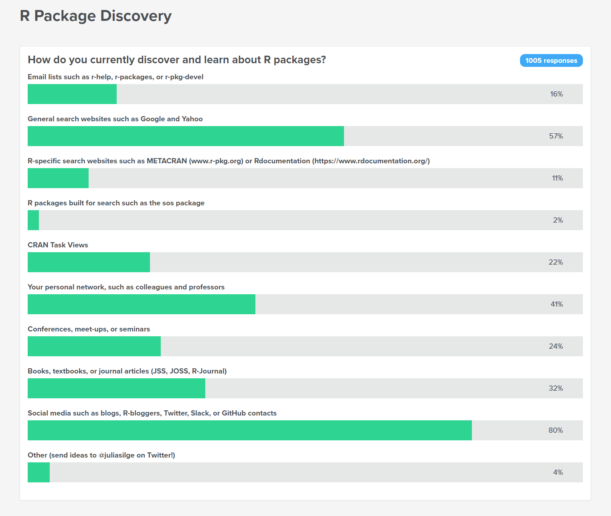

# About R
## R
- Open source language written in 2001
- Backwards compatible with commercial but out of support language S(plus)

```{r}
myVar <- rnorm(10)
plot(myVar)
```

## Things to keep in mind
- R works in-memory
- R works on a single processor
- R is basically very old and so *quirky*
- R is case-sensitive
- For later "There's a package for that"

## Alt-R
As R is open source, there are some commercial implementations of R:

- Microsoft R Server
- TIBCO TERRE
- Oracle

## Why use R
- Great for stats and data viz
- Super extendable
- Use lots of other languages through it

## Why use R
```{r include=FALSE}
library(tidyverse)
library(ggplot2)
```

```{r warning=FALSE, message=FALSE}
# A demo of dynamic CSV processing
list.files("../data", full.names = TRUE) %>% 
  map_df(read_csv, col_types=cols("c")) %>% 
  bind_rows() ->
  allmydata
```

## Why use R
```{r echo=FALSE}
# Same chart different data
readFun<-function(x){
  x %>% 
  read_csv() %>%
  mutate(floors=as.numeric(`The number of floor/stories your residence has`)) 
}
```

```{r warning=FALSE, message=FALSE}
p<- ggplot(readFun("../data/csv1.csv"), aes(x=floors)) +
    geom_histogram() 
p
```

## Why use R
```{r  warning=FALSE, message=FALSE}
p %+% readFun("../data/csv3.csv")
```

## Why use R

[Coffee demo](https://stef.shinyapps.io/cost_of_coffee/)

# Using RStudio
## IDE
An IDE is an Interactive Development Environment. The aim is to make coding easier and, therefore, make you more productive.

## Where everything is


## Code-completion
As we're typing Rstudio can help us out.


## Projects
- Projects are folder structures with an extra file. 
- This extra file is used by RStudio to open the directory. 
- Projects can have some options associated with them.

## Exercises
1. Create a new project called Rtraining
2. Create a new file called MyFirstScript.R
3. Use code completion to see what functions are available to you that begin with `a`
4. Q: Will you get a different list if you typed `A`?

# Useful resources
## Local help
- Code-completion
- `?function` and `??function`


## Cheatsheets
- [RStudio](https://www.rstudio.com/resources/cheatsheets/)

## Online resources
- [Stack Overflow](https://stackoverflow.com)
- [Twitter #rstats](https://twitter.com/search?q=%23rstats)
- [Metacran](https://www.r-pkg.org/)
- [RDocumentation](rdocumentation.org)

## Offline / in-person
- [Meetups](http://jumpingrivers.github.io/meetingsR)
- [Conferences](https://jumpingrivers.github.io/meetingsR/events.html)


# R super-basics
## R data types

Data type | Example
------------- | -------------
Integer | 1
Logical | TRUE
Numeric | 1.1
String / character  | "Red"
Factor (enumerated string) | "Amber" or 2 in c("Red","Amber","Green")
Complex | i
Date | "`r Sys.Date()`"

## Maths
Action | Operator | Example
------------- | ------------- | -------------
Subtract | - | `5 - 4` = `r 5 - 4`
Add | + | `5 + 4` = `r 5 + 4`
Multiply | \* | `5 * 4` = `r 5 * 4`
Divide | / | `5 / 4` = `r 5 / 4`
Raise to the power | ^ | `5 ^ 4` = `r 5 ^ 4`
Modulus | %% | `9 %% 4` = `r 9 %% 4`
Integer division | %/% | `9 %/% 4` = `r 9 %/% 4`
Basic sequence | : | `1:3` = `r 1:3`


## Exercises
1. See if `pi` exists
1. What is the result of `pi^2`?

## Comparison

Action | Operator | Example
------------- | ------------- | -------------
Less than | < | `5 < 5` = `r 5 < 5`
Less than or equal to | <= | `5 <= 5` = `r 5 <= 5`
Greater than | > | `5 > 5` = `r 5 > 5`
Greater than or equal to | >= | `5 >= 5` = `r 5 >= 5`
Equal | all.equal() | `all.equal(0.5 - 0.3,0.3 - 0.1)` is `r all.equal(0.5 - 0.3,0.3 - 0.1)`
Exactly equal | == | `(0.5 - 0.3) == (0.3 - 0.1)` is `r (0.5 - 0.3) == (0.3 - 0.1)`, 2 == 2 is `r 2==2`
Not equal | != | `(0.5 - 0.3) != (0.3 - 0.1)` is `r (0.5 - 0.3) != (0.3 - 0.1)`, 2 != 2 is `r 2!=2`

## Exercises
1. Is pi greater than 3?
2. What are the results if you check to see if a sequence of 1 to 5 is less than or equal to 3?

## Logic
Action | Operator | Example
------------- | ------------- | -------------
Not | ! | `!TRUE` is `r !TRUE`
And | & | `TRUE & FALSE` is `r TRUE & FALSE`, `c(TRUE,TRUE) & c(FALSE,TRUE)` is `r c(TRUE,TRUE) & c(FALSE,TRUE)`
Or | `|` | `TRUE | FALSE` is `r TRUE | FALSE`, `c(TRUE,FALSE) | c(FALSE,FALSE)` is `r c(TRUE,FALSE) | c(FALSE,FALSE)`
Xor | xor() | `xor(TRUE,FALSE)` is `r xor(TRUE,FALSE)`
Bitwise And | && | `c(TRUE,TRUE) && c(FALSE,TRUE)` is `r c(TRUE,TRUE) && c(FALSE,TRUE)`
Bitwise Or | `||` | `c(TRUE,FALSE) || c(FALSE,FALSE)` is `r c(TRUE,FALSE) || c(FALSE,FALSE)`
In | %in% | `"Red" %in% c("Blue","Red")` is `r  "Red" %in% c("Blue","Red")`
Not in | !( x %in% y)  | `!("Red" %in% c("Blue","Red"))` = `r !("Red" %in% c("Blue","Red"))`

## Exercises
1. See what's in the variable `LETTERS`
1. Write a check to see if "a" is present in `LETTERS`
1. Find out which values in the sequence 1 to 10 are greater than or equal to 3 and less than 7

## States

States | Representation  
------------- | -------------
True | `TRUE` `1`
False | `FALSE` `0`
Empty | `NULL`
Unknown | `NA`
Not a number e.g. `0/0`| `NaN`
Infinite e.g. `1/0` | `Inf`

## Other key syntax

Action | Operator | Example
------------- | ------------- | -------------
Create / update a variable | <- | `a <- 10`
Create / update a variable | = | `a = 10`
Create / update a variable | -> | `10 -> a`
Comment | # | `# This is my comment`
Help | ? | `?data.table`
Identifier | \` |  `` `1`<-2``


## Exercises
1. Amend the lines of code you've written so far to store the calculations in variables
2. Add some comments that help you remember what each line taught you

# R objects
## In-memory
- All variables / objects will get stored in-memory
- You need memory for operations too

Function | Purpose  
------------- | -------------
`ls()` | List what's in-memory
`rm()` | Remove things from memory

## Vectors
A 1D object containing a single type of data

Function | Purpose  
------------- | -------------
`c()` | Combine values into a vector
`:` | Generate a sequence

```{r}
1:3
c("red","blue","orange")
```

## Exercises
1. Make a vector containing the numbers 1 to 50
2. Make a vector containing two words
3. What happens when you combine these two vectors?

## Data.frames
A 2D object containing multiple classes of data

Function | Purpose  
------------- | -------------
`data.frame()` | Construct a data.frame

```{r}
data.frame(a=1:2,b=c("blue","red"))
```

## Exercises
1. Make a data.frame the two vectors you created in the vectors section
2. What happened to your text vector?

## Lists
An object containing multiple types of objects

Function | Purpose  
------------- | -------------
`list()` | Construct a list

```{r}
list(a=1:2,
     b=c("blue","red"), 
     df=data.frame(a=1:2,b=c("blue","red")))
```

## Exercises
1. Make a list containing some of the variables you've created so far.

## Others
- **Matrix** A 2D object of one data type
- **Array** A nD object of one data type


# R functions
## Using a function
A function does some computation on an object. The use of a function consists of:
1. A function's name
2. Parentheses
3. 0 or more inputs

```{r}
Sys.Date()
sum(1:3)
```

## Function arguments
Functions can have:

- 0 arguments e.g. `Sys.Date()`
- all mandatory arguments e.g. `length()`
- optional arguments e.g. `sum()`
- arguments used out of position by using their names e.g. `rnorm(mean=1, n=10)

## Common functions
Area | Functions  
------------- | -------------
Metadata | `class`, `mode`,`length`, `names`, `nrow`, `ncol` 
Measures | `mean`, `median`, `mode`, `range`, `sum`, `cumsum`
Strings | `grep`, `gsub`, `substr`, `trim`, `toupper`, `paste`
Files | `list.dirs`, `list.files`, `file.exists`


## Finding functions
Find functions by:

- Using code-completion
- Using help-pages
- Using `?mean`
- Using `??mean`
- Using `apropos("mean")`

## Seeing how functions work
You can examine how many functions work by just typing their name without any parentheses.

```{r}
Sys.Date
```

## Exercises
1. Find a function that involves Normal distributions
2. Find some functions operate on files


# R packages
## What is a package?
An R package is a bundle of functions and/or datasets. It extends the capabilities that the "base" and "recommended" R packages have. This gives us the ability to do a lot more.

## Using packages
- Install a package with `install.packages()`
- Load a package with `library()`
- See what's in a package / reference it without loading `packagename::function()`
- See what's in a package but not exposed to the public `packagename:::function()`

## Useful packages
Area | Packages  
------------- | -------------
Data manipulation | `dplyr`, `data.table`,`tidyr`, `stringr`, `forcats`
Data visualisation | `ggplot2`,`leaflet`,`ggraph`
Statistics | `tidytext`, `caret`, `broom`
I/O | `RODBC`, `DBI`, `data.table`, `readxl`
Web | `rvest`, `httr`, `urltools`
Outputs | `rmarkdown`, `revealjs`, `shiny`, `flexdashboards`

## Finding packages


## Package documentation
Packages should have documentation at the following levels:

- Function
- Workflow via vignettes
- NEWS
- DESCRIPTION
- READMEs on github

## Exercises
1. Load the library dplyr
2. Browse dplyr's help pages
3. Read a dplyr introductory vignette
4. Read dplyr's README

# R data manipulation basics

## Grid references
R works in a grid reference system like [row , column]. So...

- For a 1D vector, there's just one position i.e. `vector[ row ]`
- For a data.frame, there's two positions i.e. `data.frame[ row , column ]`

## Grid references

## Grid references


## Grid references
Valid values include:

- positive values or ranges
- negative values or ranges
- boolean ranges
- names or vectors of names

## Grid referencing


## Grid referencing vectors
```{r}
LETTERS[1]
LETTERS[1:3]
LETTERS[-1]
LETTERS[-13:-1]
LETTERS[c(TRUE,FALSE)]
```

## Grid referencing data.frames
```{r eval=TRUE}
myDF<-data.frame(a=1:3, b=2:4, c=3:5)
myDF[1,]
myDF[,-1]
myDF[1,1]
myDF[1:2,]
myDF[c(TRUE,FALSE,TRUE),]
myDF[,"a"]
```

## Exercises
1. Select all `letters` before "x"
1. Select the first 5 rows from the built-in data.frame `iris`
1. Select the first 2 columns from `iris`
1. Select the column Sepal.Length from `iris` by name

## Name-checking
Row names can be used to extract values.

```{r}
myNamedVec<-c("red"="RED","blue"="BLUE")
myNamedVec["red"]
```

## Name-checking
Column names can also be referenced.

```{r}
colnames(  iris[,"Species"]    )
colnames(  iris$Species        )

colnames(  iris[,c("Sepal.Width","Species")]    )
```

## Self-referencing
Useful for creating booleans, you can create a vector and use this inside your grid reference system.
```{r}
LETTERS[LETTERS<"T"]
myDF[myDF$a<=2,]
```


## Exercises
1. Get all `letters` that occur after "g"
1. Select rows from the `iris` data.frame where the `Sepal.Length` is greater than 5.8cm
1. Select rows from the `iris` data.frame where the Sepal.Width is below the average for that column

## Updating
You can update part or all of simple objects by assigning new values against a grid-reference.

```{r}
myVec<-LETTERS[1:3]
myVec[1]<-"Z"
myVec

myDF[1, ]<- 1:3
myDF
```

## Deleting
You can use the selections to remove values

```{r}
myVec<-myVec[-2]
myVec

myDF<-myDF[-3,-1]
myDF
```

## Exercises
1. Select everything from `iris` except the Species column
2. Create a copy of the `iris` data that just contains the first 100 rows and call it `myIris`
3. Update the species column to the value "Unknown" in `myIris`
3. Delete rows from `myIris` where the sepal length is greater than 5.5
